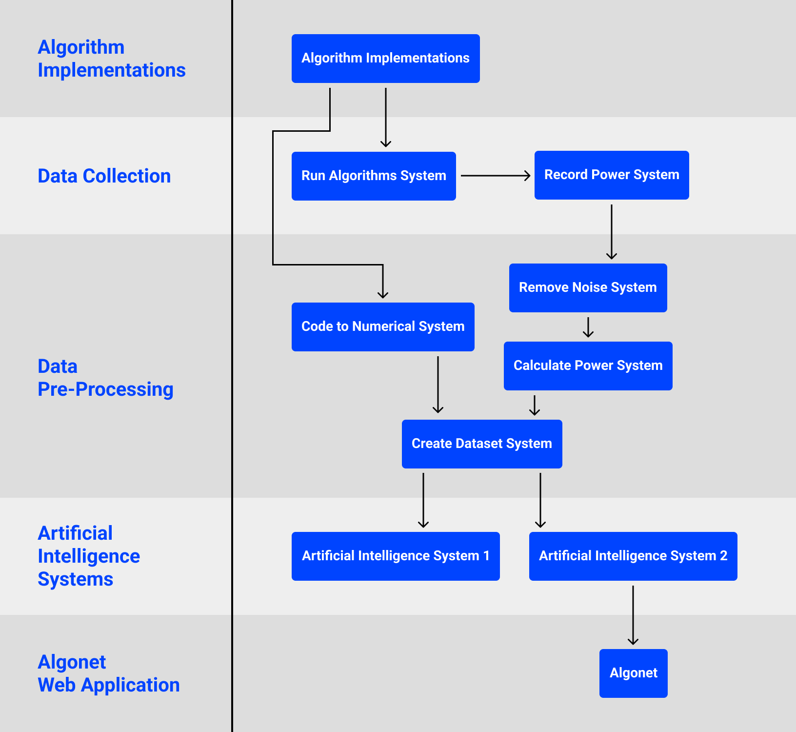

#  Algonet & The Prediction of Energy Consumption of Algorithm Implementations

Predicting energy consumptions of algorithm implementations using AI. This project's highest performing AI model produced a prediction to actual power consumption correlation of 0.97.

## System Overview Diagram

## 01 Algorithm Implementations

A set of implementations of some widely known algorithms. They were used in this project in the process of generating the dataset for the AIs.

### Dependencies

-   Node.js

## 02 Run Algorithms System

A system that runs a subset of the previous algorithm implementations, each on a loop for a specified amount of time.

### Dependencies

-   Node.js

## 03 Record Power System

A system that obtains present power data from a smart plug and records it. Intended to be run while the Run Algorithms System is running on a separate device.

### Dependencies

-   Node.js
-   tp-link-tapo-connect

## 04 Code-to-Numerial System

A system that converts the written code of the algorithm implementations into numerical data for the AIs to receive as inputs.

Uses a variation of the bag of words model where both words, operations, and their parents are recorded. This was designed to account for time complexity. For example, a regular bag of words would not record nested for loops but instead would just count the number of for loops, whereas by including the parents of words, nested for loops would be recorded as nested for loops and not separate ones.

### Dependencies

-   Node.js

## 05 Remove Noise System

A system that takes the wattage data, obtained by running the Record Power System, and produces a less noisy version of it by removing anomalies and flattening fluctuations.

### Dependencies

-   Node.js

## 06 Calculate Power System

A system that calculates the milliwatts consumed per iteration of each algorithm implementation using the real data obtained.

### Dependencies

-   Node.js

## 07 Create Dataset System

A system that takes all the results of both the Code-to-Numerical System and the Calculate Power System to generate a single dataset to be used by the AIs.

### Dependencies

-   Node.js

## 08 AI System 1

An AI system that attempts to predict the relative energy consumption of algorithm implementations by calculating the cosine distance of each algorithm and clustering them using affinity propagation.

### Dependencies

-   Python
-   numpy
-   scipy
-   sklearn
-   json

## 09 AI System 2

A set of neural networks with different architectures and parameters that were trained to predict the energy consumption of algorithm implementations. The best subsystem produced a prediction to actual power consumption correlation of 0.97.

### Dependencies

-   Python
-   PyTorch
-   numpy
-   json
